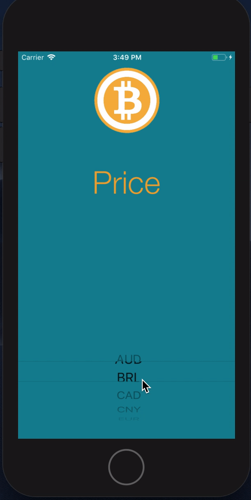

# Bitcoin-Ticker

A iOS app that allows users to display the value of bitcoin in different currenices 

**App**

---

## Features

- Used Swift to program the functionality.
- Used Alamofire cocoapod to get the network response.
- Used SwifyJSON cocoapod to parse the JSON object.
- Used the BitcoinAverage api to get the bitcoin values in different curriences.
---

## Contact

Reach out to me at one of the following places!

- <a href="https://www.linkedin.com/in/zubair-amjad/" target="_blank">`LinkedIn`</a>
- <a href="https://www.facebook.com/ZubairAmjad" target="_blank">`Facebook`</a>

---

## License

- **[MIT license](http://opensource.org/licenses/mit-license.php)**
- Copyright 2019 © <a href="https://github.com/amjadz" target="_blank">Zubair Amjad</a>.
